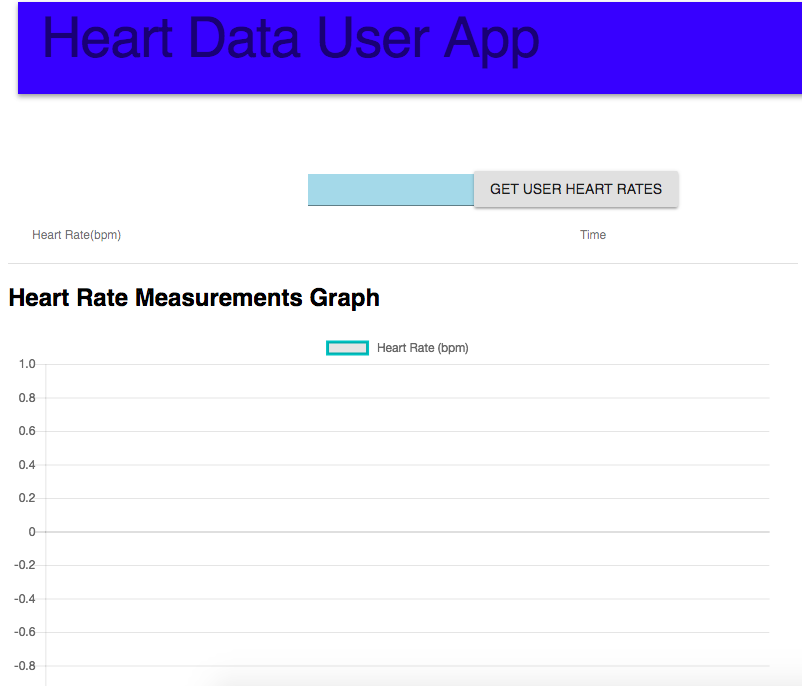
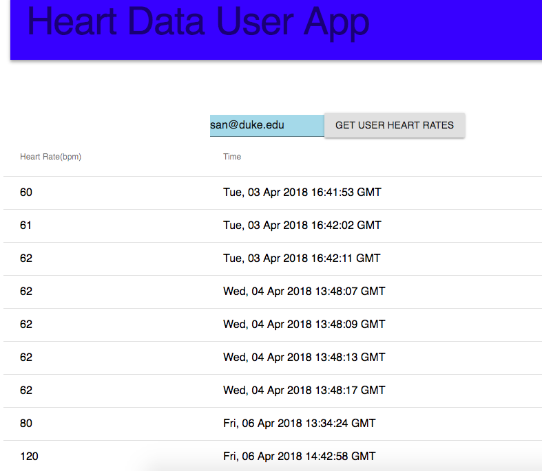
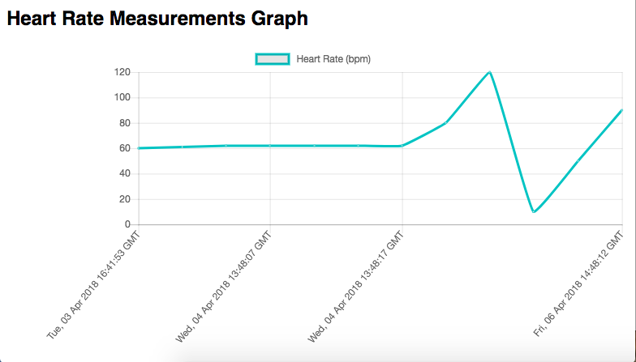

# Heart Rate Viewer

Developed by: Souhaila Noor

Course: Medical Design Software

Goal: 
Create a front end platform to pull heart rate and associated time based on the user's email. 
This repository builds on an existing repository https://github.com/souhaila30/heart_rate_databases_introduction

Steps:
1. npm install
2. Install dependencies in requirements.txt from https://github.com/souhaila30/heart_rate_databases_introduction
3. Run web_server.py in flask from https://github.com/souhaila30/heart_rate_databases_introduction
4. Run mongodb on dockerhr_
5. npm start run

After you complete these steps, you should see this in your browser. 

 

After you enter an email address associated with a user in the database, the table and chart will populate with the heart rate times and heart rates measurements.

 

 
